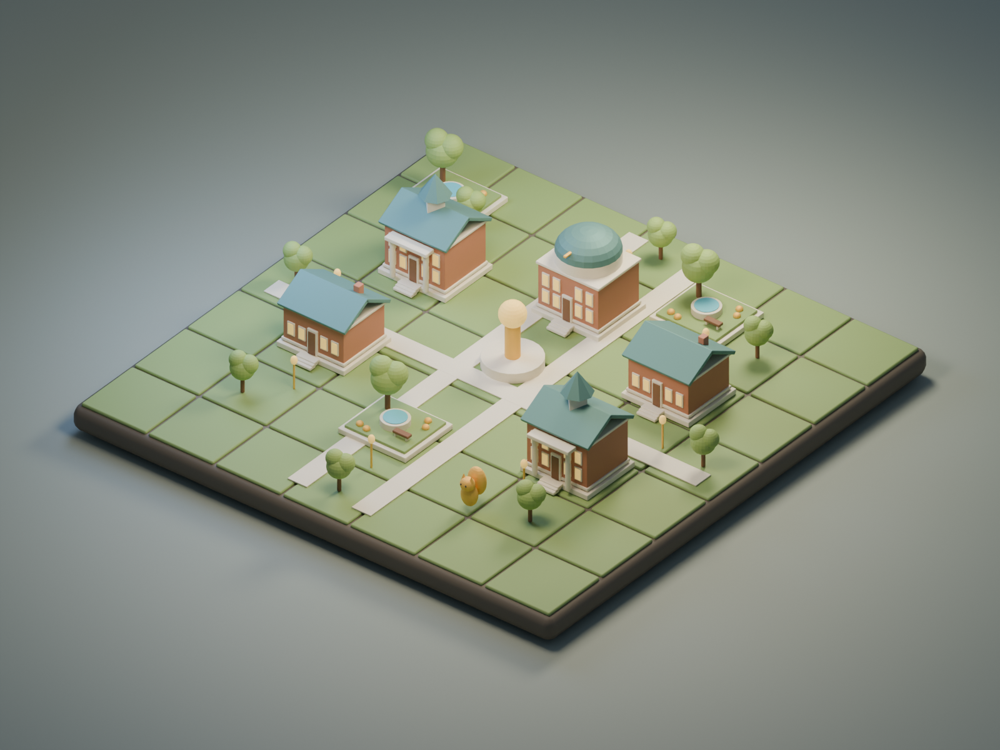

# Cosmic Squirrels: Albion Odyssey

Explore memories. Build your legacy. Together, anywhere.

An Unreal Engine C++ prototype with an original Blender environment kit for a campus exploration and creative building game inspired by Albion College. Players collect memory echoes, turn starlit acorns into a personal campus, and contribute to a shared Constellation Beacon. Room play requires neither GPS nor a camera.


## Current status — 0.1.0 prototype source

The portable C++ game rules are compiled and tested, and the Blender models and renders have been generated and inspected. **The Unreal module and editor import script have not yet been compiled or run in Unreal.** Unreal Engine is not installed on the development Mac; Epic Launcher is installed but its engine page could not be opened through the available UI controls. There is no packaged executable in this repository yet.

This is a foundation for the larger game, not a finished release. The campus appearance uses original, stylized architectural concept models. It is not photorealistic or an accurate reconstruction of Albion's grounds. The fantasy appearance adds purple masonry, celestial details, and storybook colors.

| Capability | Implementation status |
| --- | --- |
| Room exploration and campus building | Native Unreal source implemented; in-engine verification pending |
| Two appearances per player | Eight generated Blender/FBX modules; source switches appearances |
| Four independent personal campuses | Local pass-and-play profiles; not four simultaneous online players |
| Shared building project | One local Beacon with tracked per-profile contributions |
| Memory collection, journal, guided objectives | Native source implemented; twelve entries with fact/fiction labels |
| Persistence | Versioned Unreal SaveGame with input validation; in-engine round-trip pending |
| Real-world location collection | Tested distance/accuracy/permission policy only; no live GPS adapter yet |
| AR, accounts, online multiplayer, chat | Not implemented |
| Realistic surveyed campus, full 360 coverage | Reference gathering started; capture and reconstruction remain |
| Adaptive AI | Not implemented; current objectives use deterministic progression rules |

## Open in Unreal

1. Install Unreal Engine through Epic Games Launcher. The project association is set to **5.5** as a baseline; choose a version compatible with your installed macOS and Xcode. See [Epic's Mac requirements](https://dev.epicgames.com/documentation/en-us/unreal-engine/macos-development-requirements-for-unreal-engine). No engine-version combination is claimed tested yet.
2. Open `AlbionOdyssey.uproject`. Let Unreal build the C++ module. If using a different engine version, switch the project association first.
3. In the editor, run **Tools → Execute Python Script → Tools/setup_unreal.py**. This imports the eight FBX files, creates the shared material, and saves `/Game/Maps/LegacyCampus`. A missing-map warning on first launch is expected before this step.
4. Press **Play**. The native game mode creates the campus grid, collectibles, camera, and HUD at runtime.

On macOS the optional helper builds the editor target and opens Unreal with the setup script:

```sh
UE_ROOT='/path/to/UE_5.5' bash Tools/build_mac.sh
```

The setup script is safe to rerun for asset updates and keeps an existing map. It replaces generated imports under `/Game/Generated`, so put hand-authored content elsewhere.

## Play the prototype

Start with six acorns. Click the glowing memories around the island to collect three more per memory. Select a building, click an empty tile, and begin designing. Every profile can collect all twelve memories. Collection does not depend on leaving your room.

| Control | Action |
| --- | --- |
| Left click | Collect a memory or build on a tile |
| 1 / 2 / 3 / 4 | Garden (2), Library (4), Observatory (6), Hall (3) |
| Right click | Reclaim a building for a full refund |
| T | Switch your campus / fantasy appearance |
| Tab | Switch to the next of four local Keepers |
| C | Contribute two acorns to the shared Beacon (24 total) |
| J | Open/close the memory journal |
| [ / ] | Browse collected memories while the journal is open |
| E | Toggle room exploration / construction |
| W A S D | Move the camera focus |
| Q / R | Orbit the camera |
| Mouse wheel | Zoom |
| Home | Reset the camera |

Changes save after successful transactions, appearance switches, and profile switches. Saves are local to the installation and use `AlbionOdyssey_Local_v1`. A local profile is a convenience for shared-device play, not an authenticated identity.

The first objectives guide collection, building three structures, and completing the Beacon. All four Keepers can contribute. There is no paid currency and no penalty for redesigning: buildings return their full construction cost.

## Blender source and previews

Open `Art/AlbionConceptKit.blend` in Blender. The scene selector contains **Campus Concept** and **Echo Fantasy**. Each has its own camera and lighting. The initial scene contains the reusable source meshes, hidden from rendering.



The library, hall, observatory, and garden each have Campus and Fantasy versions. The source meshes use meters and FBX unit metadata; Unreal imports them in centimeters. Each module fits one 420 cm game tile. Assets are original procedural geometry, not downloaded college photographs or logos.

To regenerate with Blender (tested with Blender 5.2.1 LTS):

```sh
/Applications/Blender.app/Contents/MacOS/Blender --background --python Tools/generate_assets.py
```

## Verify changes

```sh
bash Tools/test.sh
```

This compiles the same engine-independent rules included by the Unreal game using address/undefined-behavior sanitizers, then checks project metadata, scripts, and exported assets. It covers collection, duplicates, costs, refunds, profile isolation, shared contributions, invalid state, location-policy edge cases, and 100,000 randomized transactions. GitHub Actions runs this check on pushes and pull requests. **These checks do not establish that the Unreal module compiles or renders correctly.** See [the native verification checklist](Docs/Verification.md).

## Project guide

- `Source/AlbionOdyssey/Core`: portable rules and optional future location eligibility policy.
- `Source/AlbionOdyssey/OdysseyGame.*`: Unreal world, input, HUD, memory archive, and local saves.
- `Tools`: Blender generation, Unreal import, macOS build helper, tests, and validation.
- `Art`: editable Blender file, eight FBX modules, and two rendered previews.
- [Campus references](Docs/CampusReferences.md): official map/tour and reconstruction plan.
- [Game direction](Docs/GameDesign.md): dual-mode vision and planned creative features.
- [Next implementation milestones](Docs/Roadmap.md): concrete work needed for the full game.

No student ID, credentials, personal location records, or third-party photographs are included.
